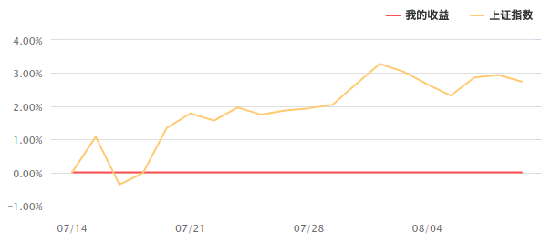
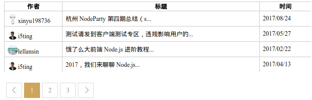

### 前言

最近两周时间基本都花在了这个项目上，虽然只是个运营活动，但是遇到的问题还是比想象的要多。数下从上上周的周六开始拿到ui稿，然后上周完成了页面的样式，这周主要在实现js的逻辑。每天都是基本10点走的，人很疲倦,都出现黑眼圈了，自己在同花顺都没这么加班过。这里我贴下这个活动页面的地址，参加大赛需要去指定的券商开一个户，然后参加模拟炒股，收益率为正的话就能瓜分100万元了，是真的可以领到钱! [大赛地址](https://ozone.10jqka.com.cn/tg_templates/doubleone/2017/kh/yiyuan_mncg/pc/apply.html)

### 对自己的总结
1. 培养自己的代码书写习惯，对可能出错的地方要做好判断
大赛在开发的过程中，模拟炒股部门那边的接口经常不稳定，有时候传参没错，但是返回值却是空，如果直接使用`res.aaa.bbb === '0'`判断接口是否返回正常有时候就会报错(Can't read property of undefined)。正确的方式应该是先判断res是否为空，或者在最外层加一个`try catch`。
```javascript
try{
  if (res.ret['@attributes'].code === "0") {
    // 正确处理
  } else {
    // 错误处理
  }
}catch{
  // 异常处理
}

```
2. 对于变量类型要谨慎，特别是使用某种类型的自带方法
比如如果你定义一个数值类型，使用`toFixed`当然没有问题，但是如果换成字符串类型，即使字符串显示的是一个数字('100', '101')，直接调用`toFixed`的也会报错.正确的方式应该是做好类型判断或者在不确定类型的时候使用`parseFloat`将不确定类型的变量转换成数值类型。

3. 遇事要冷静，内心越着急，就越容易忽略一些小细节
这个发生在同步代码的时候，因为是改线上代码，有些着急。结果每次改完自己去线上检查总是发现一些没有注意到的小bug，最后来来回回改了好多次。

### 自己用到的一些插件以及demo
1. HighCharts画我的收益图


主要是对highchart的一些配置,在不清楚每个配置字段什么意思的情况下,建议好好看看[highchart.js官网给的文档和demo](https://api.hcharts.cn/highcharts), 查看源码请[点击这里](http://runjs.cn/code/asgugst0).
<br>

2. 分页插件

借助cnode官网给的公开api接口做了一个简单的demo, 其实实现分页插件并不难, 源码请看[这里](http://runjs.cn/code/lrmsauvq).
<p style="color: #999;margin-top: 10px;text-indent: 0">ps:&nbsp;做得比较丑，用runjs写这个demo的时候代码没保存的时候浏览器崩了>_<，runjs你还我代码....</p>
<br>

3. 社交分享

写了一个支持qq，微信和微博以及链接复制的分享功能，但是不支持ie8，ie9以上没问题。源码请看[这里](http://runjs.cn/code/8cz7q0nj).